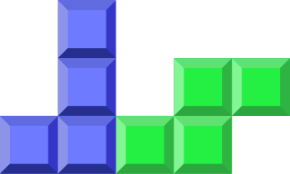

## Tetris JS: [PLAY HERE](https://tetris.uxtommy.com)

Recent additions: 
- Implemented Leaderboard
- Implemented Hard Drop feature
- Implemented Hold feature
- Implemented Pause/Resume feature
- Implemented Game Over condition
- Improved scoring and leveling system
- Added column highlighting
- Added visual instructions & on-screen keys mirroring
- Added in-game timer
- Added Restart option
- Rebinded keys to be more similar to other versions
- Completely redesigned the GUI

To do:
- Implement Super Rotation System (SRS)
